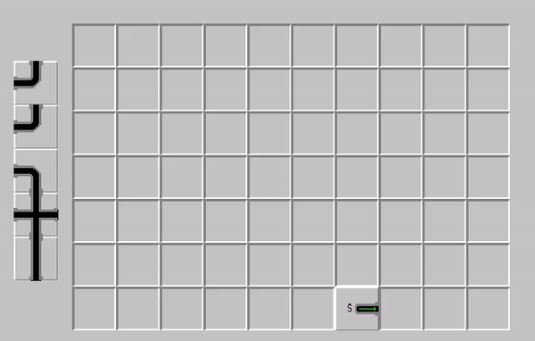
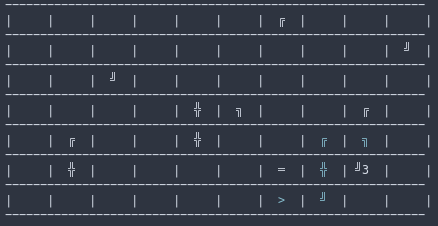
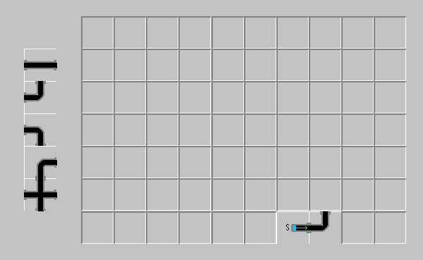
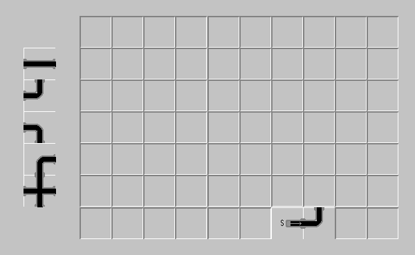
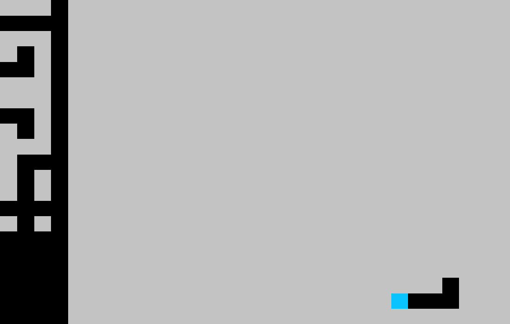

# gym-pipedream *readme in progress

An [OpenAI Gym](https://github.com/openai/gym) environment inspired by the Windows 95 game, [Pipe Dream](https://en.wikipedia.org/wiki/Pipe_Mania). 

Human Rendering:



Ascii Rendering:



### **Requirements**
- Python 3
- OpenAI Gym
- ...

## Installation
You can install this repository via pip:

```
pip install git+https://github.com/Jelso13/gym-pipedream/
```

## Design
---
The environment is split into two sections
1. Main Board
2. Pipe Queue

## State Space

---
## Action Space
- Actions are taken by placing the pipe at the end of the queue on the board in a valid position.
- Actions are given by a tuple: (x, y)
  - 0 <= x <= board_width
  - 0 <= y <= board_height

---
## Reward
- +1 every step taken
- -10 on water leaking (env done)

## Wrappers
### DelayedRewardWrapper
```
env = DelayedRewardWrapper(env)
```
Changes the reward function to only give reward of +1 every time a pipe is filled rather than every step.

### ImageObservation
```
env = ImageObservation(env)
```
Returns an RGB image as the state observation.


### GrayScaleObservation
```
env = GrayScaleObservation(env)
```
Provides a gray scale version of the image environment.


### SimplifiedImageObservation
```
env = SimplifiedImageObservation(env)
```
Provides a simplified state observation of the image environment.


# Included Environments

